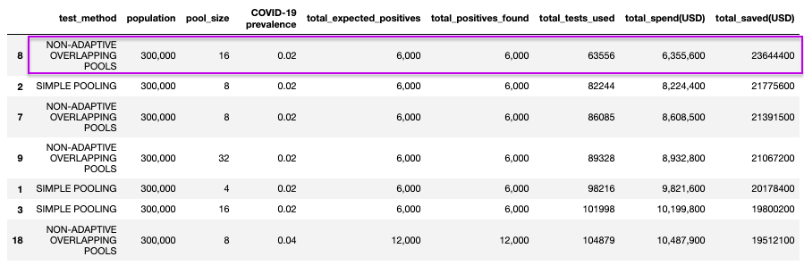

# Comparing Pool Testing Methods

Traditional pool testing methods are dilutive simple pools which are easy to administer but require retesting the entire pool if there is any positive cases. New studies have shown non-adaptive overlapping pools using combinatorics minimise retesting as well as false negatives. However, they work well only for countries with low virus prevalence. 

1. Design combinatorial pooling and pool size algorithms (in Python) for a population of 300,000 samples and testing capacity of 12,000 tests. Assume a prevalence of 2%, 4%, 6%, 8% and 10%.

2. Compare the amount of savings (assume single test cost USD 100) of overlapping pool versus simple pool versus single test. 

# Simple Pooling
Simple pooling involves group tests conducted on a "row" of samples(as illustrated in the diagram below). A positive test result indicates that some individual in the corresponding row is infected. Only the specimens sharing a pool with an infected specimen will need to be retested (Verdun et al, 2020).

An American research group performed such a test with 12 pools of 5 specimens, each from individuals at risk, and were able to correctly identify the two infected individuals out of the 60 with only 22 tests (Verdun et al, 2020). We'll use similar population and pool size to test our function.    

# Non-Adaptive Overlapping pools

Overlapping pools involves arrange the population into matrices of n X n size with n being the size of a pool. Here tests are conducted on the row pools and column pools of each matrix as shown in the diagram below. Only the intersection of pools that tested positively will need to be retested(Verdun et al, 2020). In this scenario, only four samples needed to go through the retesting phase. 

Not all samples will be a square number, we will write a function to extend these samples to a larger square number by adding negative ”dummy samples”(M.Täufer, 2020).

# Comparing Methods
We compared simple pooling methods against overlapping non-adaptive pooling methods -- and the amount of savings the methods provide versus an extreme method of single-testing the entire population of 300,000 samples.

Our results revealed that:

- **Pooling Works** - Our comparison reveals that our pooling methods almost always results in cost savings versus a "one-person one-test" strategy. 

- **Overlapping for lower prevalence** - Across most of our prevalence levels, overlapping pools results in higher cost savings versus simple pools. This difference in savings starts to taper as prevalence levels rise. At a prevalence level of 10%, it becomes more cost-efficient to use a simple pooling method.

- **Lack of test kits** - In our comparison, we tested a range of pool sizes as demonstrated by a paper published by UCLA(C.Mentus et al., 2020). Even in our most cost-efficient simulation -- an overlapping pool test in a population with 0.02 prevalence -- we used 63556 to identify the positives within the population. This is more than five times our testing capacity of 12000. 

- **Losses** - In four of our simulations, our methods actually result in losses. These were mainly situations with higher prevalences (0.08, 0.1) and a big pool size(64) -- further driving home the point that pooling methods becomes less cost efficient in populations with higher prevalence. We should also note that it is important to find a method to optimise pool sizes to raise cost-efficiency.

# Conclusion
- **Overlapping pools recommended for prevalence < 0.1** - Our simulations show that pooling methods serve to be effective on populations with low prevalence only. For figures under 0.1, we'd recommend the use of overlapping pools. For anything higher, simple pools prove to be more cost-efficient. 

- **Mixed methods** - As pooling methods can actually result in massive savings, it might be worthwhile to employ mixed methods by first splitting the population into symptomatic and asymptomatic. Taking out symptomatic cases theorectically lowers the prevalence in the latter group (C.Mentus et al. , 2020). We can then test symptomatic cases with single tests and the rest with a pooling method. 

- **Diagonal Overlapping Pool** - Currently, our overlapping pool method only tests our rows and columns. Efficiency might improve if we add an additional diagonal pool (M.Täufer, 2020).

# References

- Verdun, Claudio M., et al. “Group Testing for SARS-CoV-2 Allows for up to 10-Fold Efficiency Increase across Realistic Scenarios and Testing Strategies.” *MedRxiv*, Cold Spring Harbor Laboratory Press, 1 Jan. 2020, www.medrxiv.org/content/10.1101/2020.04.30.20085290v2.

- Ben-Ami, Roni, et al. “Large-Scale Implementation of Pooled RNA-Extraction and RT-PCR for SARS-CoV-2 Detection.” 2020, doi:10.1101/2020.04.17.20069062.

- Täufer, Matthias. “Rapid, Large-Scale, and Effective Detection of COVID-19 ...” *MedRxiv*, www.biorxiv.org/content/10.1101/2020.04.06.028431v1.

- Mentus, Cassidy, et al. “Analysis and Applications of Adaptive Group Testing Methods for COVID-19.” *MedRxiv*, Cold Spring Harbor Laboratory Press, 1 Jan. 2020, doi.org/10.1101/2020.04.05.20050245.
